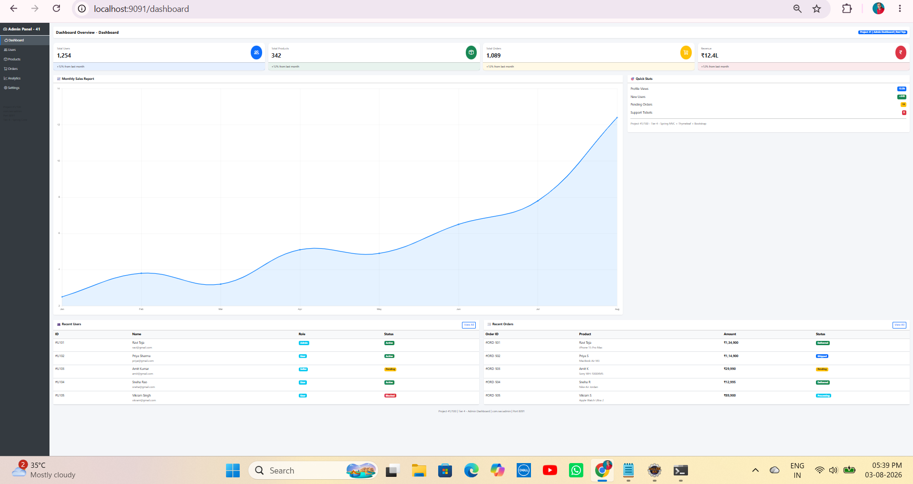
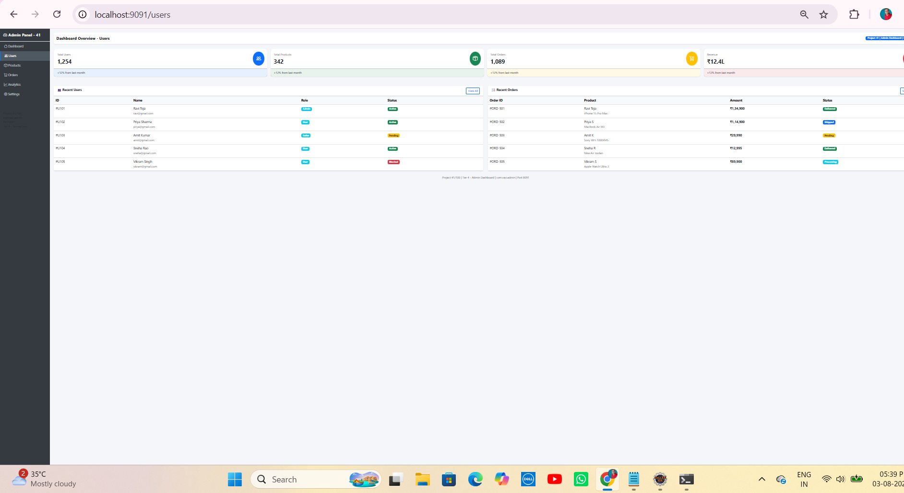
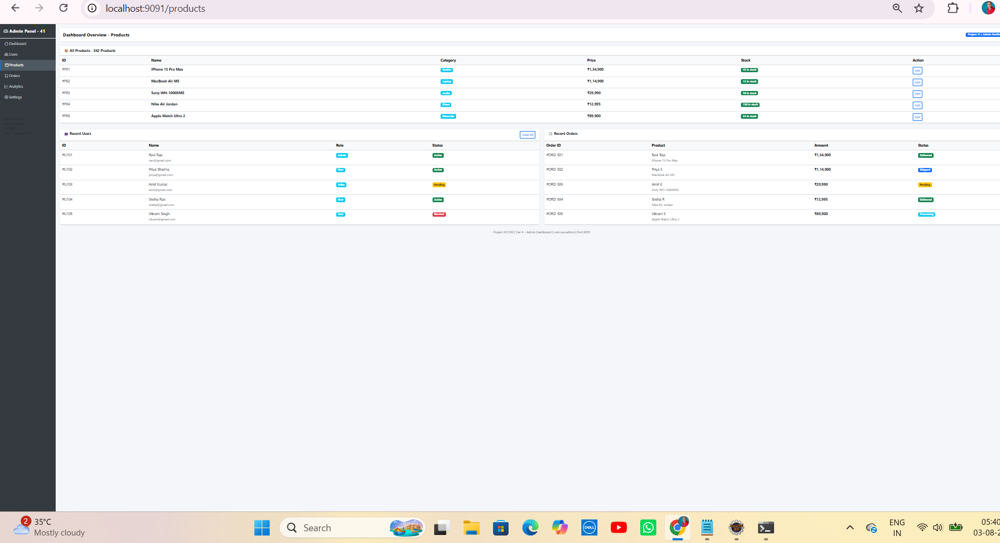
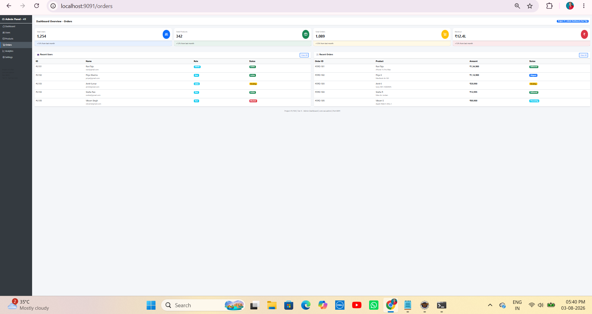
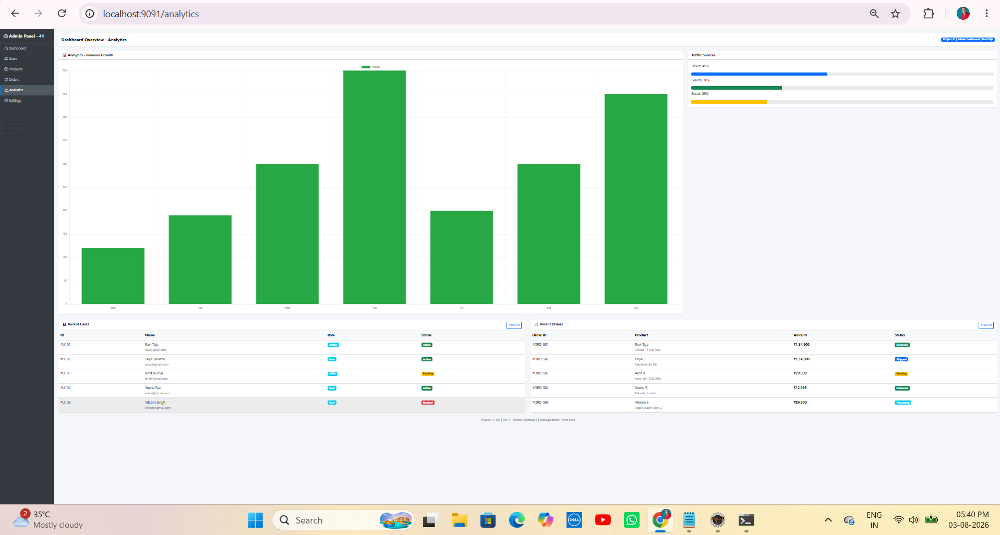
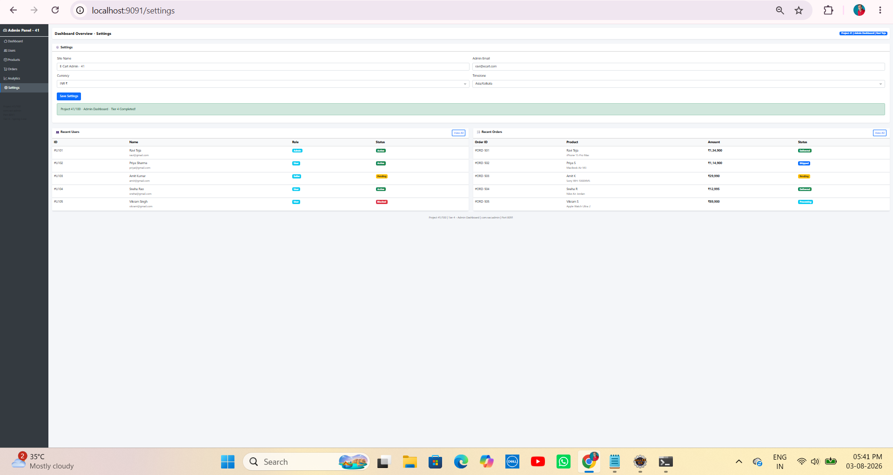

# 📝 Project 41 – Admin Dashboard


---


# 📖 Project Overview

**Admin Dashboard** is the ninth project of **Tier 4 – Spring Framework**, developed using **Java 21**, **Spring Boot 4.1.0**, **Spring Web MVC**, and **Thymeleaf**.

The application is a professional admin dashboard inspired by modern e-commerce platforms such as Flipkart Seller and Amazon Admin Panel. It demonstrates dashboard statistics, user management, product inventory, order tracking, analytics charts, settings management, and responsive UI development using Bootstrap 5 and Chart.js. The project follows the Spring MVC architecture with an in-memory Service Layer and does not require a database.

---

# ✨ Features

- 📈 Dashboard with Statistics Cards
- 💰 Revenue, Orders, Products, and Users Overview
- 📊 Monthly Sales Chart using Chart.js
- 👥 User Management Page
- 📦 Product Inventory Management
- 🛒 Order Tracking Dashboard
- 📉 Analytics Page with Weekly Visitors Chart
- ⚙️ Settings Page with Site Configuration Form
- 🏷️ Status and Role Badges
- 🎨 Responsive AdminLTE-Style User Interface
- 📱 Bootstrap 5 Layout with Sidebar Navigation
- ⚡ Thymeleaf Template Rendering
- 📦 Service Layer using In-Memory Data
- ⚙️ Custom Server Port Configuration (8091)
- 🚀 Embedded Apache Tomcat 11 (No External Server Required)

---

# 🛠 Technologies Used

- Java 21
- Spring Boot 4.1.0
- Spring Web MVC
- Thymeleaf
- Maven 3.9+
- HTML5
- CSS3
- Bootstrap 5.3.0
- Bootstrap Icons
- Chart.js
- Apache Tomcat 11.0.22 (Embedded)
- STS / Eclipse IDE

---

# 📂 Project Structure

```text
41-admin-dashboard
│
├── src
│   └── main
│       ├── java
│       │   └── com
│       │       └── ravi
│       │           └── admin
│       │               ├── Application.java
│       │               ├── controller
│       │               │   └── AdminController.java
│       │               ├── model
│       │               │   └── Stat.java
│       │               └── service
│       │                   └── AdminService.java
│       │
│       └── resources
│           ├── templates
│           │   └── dashboard.html
│           │
│           └── application.properties
│
├── screenshots
│   ├── demo1.png
│   ├── demo2.png
│   ├── demo3.png
│   ├── demo4.png
│   ├── demo5.png
│   ├── demo6.png
│
├── .gitignore
├── pom.xml
└── README.md
```
---

# ▶ How to Run

## 1⃣ Clone the Repository

```bash
git clone https://github.com/raviteja-dev950/41-admin-dashboard.git
```

---

## 2⃣ Import the Project

- Open **STS / Eclipse IDE**
- Import the project as **Existing Maven Project**
- Wait for Maven dependencies to download

---

## 3⃣ Configure the Project

Spring Boot comes with **Embedded Apache Tomcat 11**, so no external Tomcat server configuration is required.

Verify the following configuration in **application.properties**:

```properties
spring.application.name=41-admin-dashboard
server.port=8091
```

---

## 4⃣ Run the Project

- Right-click the project
- Select **Run As → Spring Boot App**
- Wait until the console displays:

```text
Started Application in X seconds
```

Open your browser and visit:

```text
http://localhost:8091/dashboard
```

Application Flow:

```text
Browser
      │
      ▼
User Visits
/dashboard
/users
/products
/orders
/analytics
/settings
      │
      ▼
AdminController
@GetMapping(...)
      │
      ▼
AdminService
      │
      ├── Dashboard Statistics
      ├── Users List
      ├── Products Inventory
      ├── Orders List
      ├── Analytics Data
      └── Settings Information
      │
      ▼
Model.addAttribute(...)
      │
      ▼
dashboard.html
(th:if, th:each,
th:text, th:classappend)
      │
      ▼
Render Dashboard,
Tables, Charts,
Cards and Forms
```

---

# 📸 Screenshots



---



---



---



---



---



---

# 🎯 Learning Outcomes

- Understanding Spring MVC Architecture using `@Controller`
- Building a Professional Admin Dashboard using Spring Boot and Thymeleaf
- Creating a Service Layer using `@Service`
- Managing Dashboard Statistics with In-Memory Data
- Passing Data from Controller to View using `Model`
- Displaying Collections using Thymeleaf `th:each`
- Implementing Conditional Rendering using `th:if`
- Using `th:text` and `th:classappend` for Dynamic Content
- Building Responsive Dashboard Layout with Bootstrap 5
- Integrating Interactive Charts using Chart.js
- Creating Sidebar Navigation with Active Menu Highlighting
- Displaying Tables, Cards, Badges, and Forms using Bootstrap Components
- Understanding MVC Flow for Multi-Page Dashboard Applications
- Preparing the Application for Spring Data JPA and Database Integration

---

# 🚀 Future Enhancements

- 🔐 Add User Authentication and Authorization using Spring Security
- 💾 Integrate MySQL using Spring Data JPA
- 📊 Add Real-Time Dashboard Statistics
- 📈 Integrate Advanced Analytics and Reports
- 🧾 Export Reports to PDF and Excel
- 👥 Implement Role-Based Access Control (Admin, Manager, User)
- 🔔 Add Notifications and Activity Logs
- 🌙 Add Dark Mode Support
- ☁ Deploy the Application to Render or Railway
- 📱 Convert the Dashboard into a Progressive Web App (PWA)

---

# 👨‍💻 Author

**Ravi Teja**

**Java Full Stack Developer**

**100 Java Full Stack Projects Challenge**

**Project 41 / 100**

**Tier 4 – Spring Framework**


---

## ⭐ Support

If you found this project helpful, consider giving it a **⭐ Star** on GitHub.
